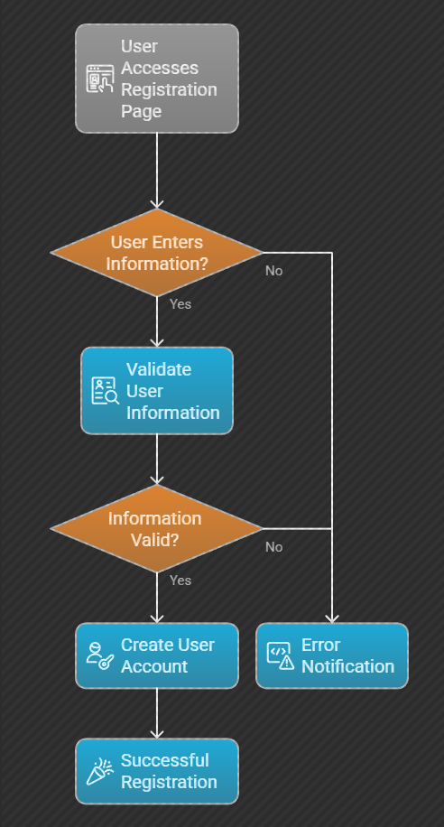

# Flowchart – User Authentication Process

## 🎯 Objective
This document describes the flowchart outlining the User Authentication process for the Airbnb Clone backend. Authentication is a core feature that ensures secure access to the platform for both guests and hosts.

## 🧭 Flowchart Overview: User Login & Authentication
This flowchart demonstrates the step-by-step backend logic when a user attempts to log into the platform.

## ✅ Workflow Steps
Start
Display Login Form
User Enters Email and Password
Validate Input Format
Check if User Exists in Database
If user not found:
Return error: "User not registered"
If user found:
Compare input password with stored hashed password
If password mismatch:
Return error: "Invalid credentials"
If credentials match:
Generate JWT access token
Store login session (if applicable)
Send success response & redirect user to dashboard
End

